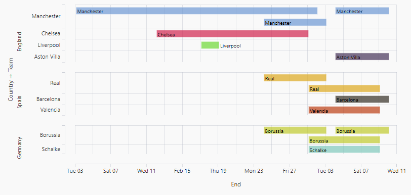
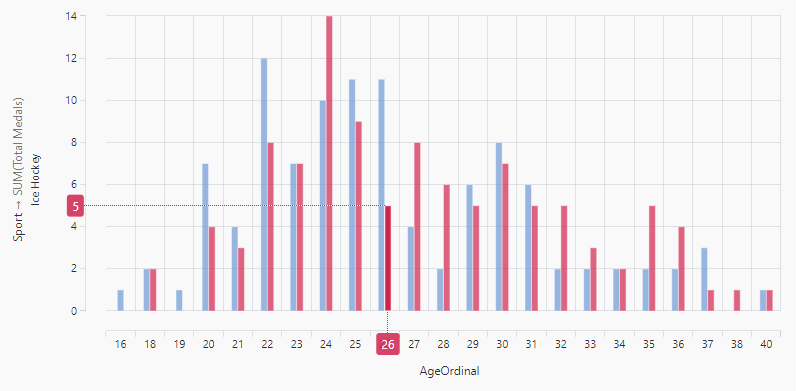
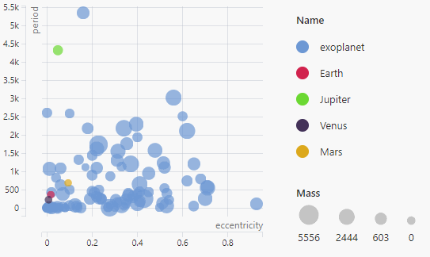
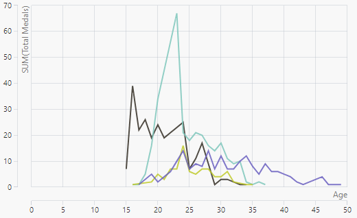
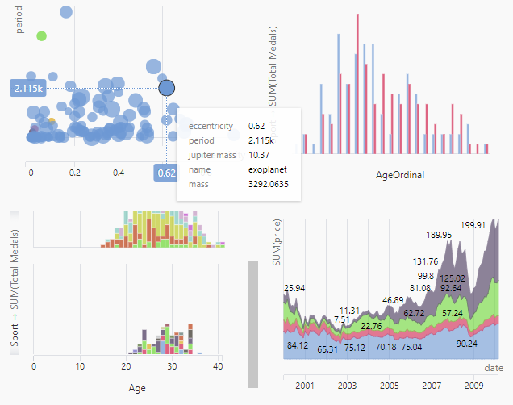
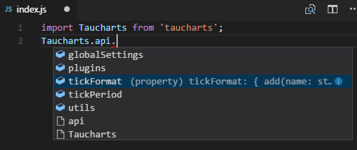
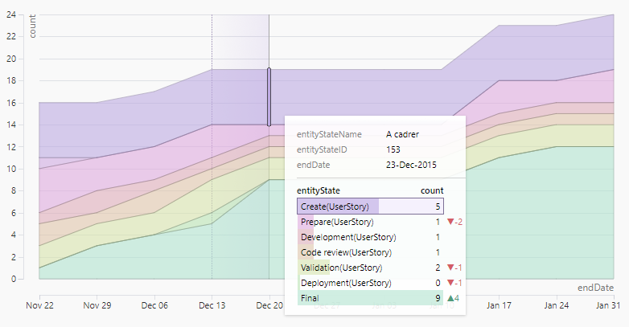

# Taucharts One

Can you think of a **charting library** that **looks fresh**, has a **simple API**, and offers **high performance**? I can think of one: **Taucharts One**. The latest stable release (v.1.2.2) can be downloaded via [npm](https://www.npmjs.com/package/taucharts).

Let's see what this new release comes with.

## Bar as span (Timeline) plugin

**Timeline** charts are suitable for visualizing teams' **progress**.



```javascript
const chart = new tauCharts.Chart({
    type: 'horizontal-bar',
    x: 'end',
    y: ['country', 'team'],
    color: 'team',
    label: 'team',
    plugins: [
        Taucharts.api.plugins.get('bar-as-span')({
            x0: 'start',
            collapse: true
        })
    ]),
    data: [
        {start: '2015-02-29', end: '2015-03-09', team: 'Real', country: 'Spain'},
        ...
    ]
});
```

## Crosshair plugin

It is now possible to **highlight** element values **on axes**.



```javascript
const chart = new tauCharts.Chart({
    ...
    plugins: [
        Taucharts.api.plugins.get('crosshair')()
    ])
});
```

## Legend plugin improvements

You can now **focus on a single element** or **toggle multiple elements** by clicking on the relevant color icons. Size and color gradient legends are now aligned horizontally to reduce the amount of space they consume. Highlighted elements will float over others.



## Tooltip plugin improvements

Highlighting elements on a chart has never been so **fast** and simple. It is also possible to highlight points that overlap each other. **Clicking** on an element will reveal **additional options** in a tooltip.



## Sparkline mode

If chart size is **too small** or tick density is **too high**, then it's better to hide the chart's axes and grid.



```javascript
const chart = new tauCharts.Chart({
    ...
    settings: {
        // Axes are hidden when chart content
        // size is lower than these values
        minChartWidth: 300,
        minChartHeight: 200,
        minFacetWidth: 150,
        minFacetHeight: 100,
    }
});
```

## Line chart improvements

Line charts that are encoded by **size** will now look more consistent by preserving the width between their points.


```javascript
tauCharts.api.tickFormat.add('bugs-format', (x) => `${x} bugs`);
const chart = new tauCharts.Chart({
    type: 'line',
    x: 'Date',
    y: 'Effort',
    size: 'Bugs Count',     // Setup line size
    label: 'Bugs Count',
    color: 'Team',
    guide: {
        interpolate: 'smooth-keep-extremum',
        showGridLines: 'y',
        label: {
            tickFormat: 'bugs-format'
        }
    },
    plugins: [
        tauCharts.api.plugins.get('legend')(),
        tauCharts.api.plugins.get('quick-filter')(),
        tauCharts.api.plugins.get('tooltip')()
    ],
    settings: {
        utcTime: true
    },
    data: [
        {
            'Date': new Date('2015-07-01T00:00:00.000Z'),
            'Effort': 20,
            'Bugs Count': 4,
            'Team': 'Alaska'
        },
        ...
    ]
});
```

## Non-blocking rendering

Loading large amounts of data can be slow. To prevent your browser from lagging, several new chart settings have been introduced.

```javascript
settings: {
    asyncRendering: false,
    renderingTimeout: 10000,
    syncRenderingInterval: 50,
    handleRenderingErrors: true
}
```

Setting `asyncRendering: true` will make your chart **render asynchronously** in small synchronous chunks. This has the benefit of making your browser **more responsive** to user interactions. Read more about asynchronous rendering [here](https://github.com/TargetProcess/taucharts-docs/blob/master/advanced/performance.md).

## TypeScript type definition

Taucharts NPM package comes with d.ts **type definitions**. This enables automatic **code completion** in TypeScript and JavaScript files (if your IDE supports this feature) without any additional setup.



## Underscore dependency removal

Thanks **[Juanjo Diaz](https://github.com/juanjoDiaz)** for **replacing Underscore** with modern native JavaScript features.

## And even more

There's countless additional **improvements** and bug fixes. You can see the whole list [here](https://github.com/TargetProcess/tauCharts/releases/tag/1.0.0). Some notable changes are:
- UTC time scale, periods and formats (`settings.utcTime: true|false`).
- Show line and area points (`guide.showAnchors: 'always'|'hover'|'never'`).
- Smooth line and area interpolation, that doesn't exceed data points (`guide.interpolate: 'smooth-keep-extremum'|'smooth'|'linear'|'step'|'step-before'|'step-after'`).
- Lowercase package name for CommonJS and AMD (`require('taucharts')`).

## Taucharts 2

**Taucharts v2** will be released soon. It uses D3 v4 modules and will bring **new features and improvements**.



