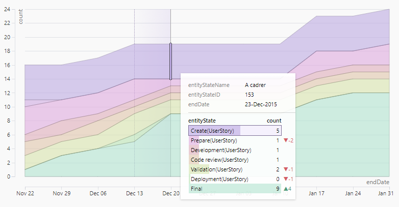

# Taucharts: Part II

Taucharts **2.0.0** has been [released](https://www.npmjs.com/package/taucharts).

Let's see how Taucharts v2 differs from Taucharts v1.

## D3 v4

Taucharts 2 uses [D3 v4](https://github.com/d3/d3) tools (previously used D3 v3) for manipulating SVG, animations, formatting values and many other cool things.

## Diff Tooltip and Time scale intervals

Diff Tooltip **compares values** at some **time interval** and also compares these values to **previous time interval**.



```javascript
const chart = new Taucharts.Chart({
    ...
    plugins: [
        Taucharts.api.plugins.get('diff-tooltip')()
    ],
    guide: {
        x: {
            timeInterval: 'week'
        },
        showGridLines: 'y'
    }
});
```

**Time scale** with intervals behaves **similar to periodic**. It clamps values to specified interval, but axis looks like continuous, not ordinal.

By default, if data for a group is missing for some time interval, line or area chart will think that value for that interval is 0. You can change this behavior by setting `guide.x.fillGaps: false`.

## Tooltip extensions API

It is now possible to extend Tooltip content. Let's add some more buttons to Tooltip.

```javascript
const chart = new Taucharts.Chart({
    ...
    plugins: [
        Taucharts.api.plugins.get('tooltip')({
            getTemplate(srcTemplate, tooltip) {
                return {

                    // Copy default template
                    ...srcTemplate,

                    // Override buttons panel content
                    buttonsTemplate() {
                        return [
                            // There is already a template for button
                            this.buttonTemplate({
                                text: 'Data',
                                cls: 'js-data',
                                icon: () => '☆'
                            }),
                            this.buttonTemplate({
                                text: 'Remove',
                                cls: 'js-remove',
                                icon: () => '✕'
                            }),
                        ].join('\n')
                    },

                    // Subscribe for interaction
                    didMount() {
                        srcTemplate.didMount.call(this);

                        tooltip
                            .getDomNode()
                            .querySelector('.js-data')
                            .addEventListener('click', (e) => {
                                e.stopPropagation();

                                // Get highlighted element data
                                const data = tooltip.state.highlight.data;

                                // Hide tooltip
                                tooltip.setState({
                                    highlight: null,
                                    isStuck: false
                                });

                                // Perform action with data
                                alert(JSON.stringify(data));
                            });
                    }
                };
            }
        })
    ]
});
```

## Migrating from Taucharts v1 to v2

- D3 v4 is now dependency.
- `Taucharts` global object name (was `tauCharts`).
- `.tau-chart__` CSS class prefix (was`.graphical-report__`).
- `export-to` plugin alias changed (was `exportTo`).
- Distributive files paths changed. `dist/taucharts.min.js` and `dist/taucharts.min.css` contain the core and all the plugins minified together. `dist/taucharts.js` and `dist/taucharts.css` contain unfinified core, JS and CSS for plugins can be found in `dist/plugins/` folder (e.g. to import a plugin you should do something like `import tooltip from 'taucharts/dist/plugins/tooltip';`).

Taucharts v1 will stop receive improvements and bug fixes, so you better migrate to Taucharts 2 today.
